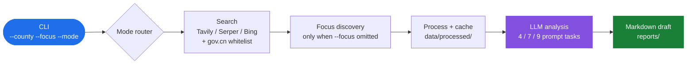

<div align="center">
  <h1>CountyResearchAI</h1>

  <p><b>An LLM-assisted research pipeline that turns a county name into a reviewable, evidence-linked industry draft.</b></p>
  <p><b>输入县名，自动完成采集 → 识别 → 分析 → 报告的县域产业研究流水线，产出可审查、证据可溯的研究初稿。</b></p>

  <p>
    <a href="#overview"><b>English</b></a> · <a href="#中文"><b>中文</b></a>
  </p>

  <p>
    <a href="https://github.com/OrdoAbChao7/CountyResearchAI/actions/workflows/ci.yml"></a>
    
    
    
  </p>
</div>

<!-- portfolio-authenticity:start -->
## Project status

**Stage:** Research prototype.

**Why I built it:** I built this to make the first pass of county-level industry desk research reproducible: collect public material, preserve evidence links, and turn the material into a reviewable Markdown draft.

**Boundary:** The generated report is a research draft, not a factual finding or policy recommendation. Search coverage varies by county and provider; LLM synthesis can omit context or make unsupported inferences. Mock mode verifies control flow only and must not be read as evidence.

See [PROJECT_STATUS.md](./PROJECT_STATUS.md) for the evidence still needed and the maintenance rule.
<!-- portfolio-authenticity:end -->

## Overview

CountyResearchAI makes the first pass of county-industry desk research reproducible. Given a county name and an optional focus, it collects configured public material, preserves source links, and produces a structured Markdown **research draft**. Three modes cover a current snapshot, a modern rise/fall timeline, and a long-cycle county trajectory.

## Key Features

- **Three research modes** — `snapshot`: four-dimensional current-state analysis (status/strengths/weaknesses/recommendations); `rise-fall`: industry boom-and-bust study (origin → expansion → decline → pattern synthesis), 8 lifecycle models; `long-history`: century-scale county trajectory from founding to today, 8 long-cycle models
- **Candidate focus discovery** — no focus given, the LLM ranks 3–5 candidate industries from retrieved material; treat the result as a hypothesis to review
- **Multi-source collection** — Tavily / Serper / Bing search + whitelisted gov.cn open data, with mode-specific query templates (10 for rise-fall, 10 for long-history)
- **Evidence traceability** — raw / processed / report three-layer retention; conclusions bound to source URLs
- **Externalized configuration** — YAML + `.env`; provider interfaces isolated so swaps have a bounded code surface
- **Mock path** — without API keys the chain still runs on synthetic inputs (control-flow demonstration only, not evidence)

## How It Works



## Quick Start

```bash
git clone https://github.com/OrdoAbChao7/CountyResearchAI.git
cd CountyResearchAI

python -m venv .venv
.venv\Scripts\activate        # Windows
# source .venv/bin/activate   # macOS/Linux

pip install -e ".[dev]"
cp .env.example .env          # fill in LLM_API_KEY + one search key
```

```dotenv
LLM_PROVIDER=deepseek
LLM_API_KEY=YOUR_LLM_API_KEY              # Required
LLM_BASE_URL=https://api.deepseek.com/v1
LLM_MODEL=deepseek-chat

SEARCH_PROVIDER=tavily
TAVILY_API_KEY=YOUR_TAVILY_API_KEY        # Required
```

Key portals: [DeepSeek](https://platform.deepseek.com/api_keys) · [Tavily](https://app.tavily.com/dashboard/api-key) · [Serper](https://serper.dev) · [Bing](https://www.microsoft.com/en-us/bing/apis/bing-web-search-api)

### Run

```powershell
$env:PYTHONPATH = "src"       # only needed when not pip-installed

python -m county_research_ai.cli -c 安吉县 -f 竹产业          # snapshot, explicit focus
python -m county_research_ai.cli -c 安吉县                      # snapshot, auto discovery
python -m county_research_ai.cli -c 鹤岗市 --mode rise-fall    # boom-and-bust study
python -m county_research_ai.cli -c 信丰县 --mode long-history  # century-scale trajectory
python -m county_research_ai.cli -c 安吉县 --dry-run            # validate params only
```

Reports land in `reports/`:

```text
{County}_{Focus}_{Date}.md        # snapshot
{County}_BoomBust_{Date}.md       # rise-fall
{County}_LongCycle_{Date}.md      # long-history
```

### CLI Options

| Option | Short | Description |
|---|---|---|
| `--county` | `-c` | County name, e.g. `安吉县` (required) |
| `--focus` | `-f` | Research focus; omitted → auto discovery |
| `--mode` | `-m` | `snapshot` (default) / `rise-fall` / `long-history` |
| `--historical` | | Shortcut for `--mode rise-fall` |
| `--long-history` | | Shortcut for `--mode long-history` |
| `--no-cache` | | Skip the processed-data cache |
| `--dry-run` | | Validate parameters only |
| `--log-level` | | DEBUG / INFO / WARNING / ERROR |

## Research Modes

| | snapshot | rise-fall | long-history |
|---|---|---|---|
| **Focus** | Current industry | Modern industry cycle | County's centuries-long fate |
| **Time scale** | Present | Last 30–50 years | Founding → present |
| **Core questions** | Status / strengths / weaknesses / recommendations | Origin → expansion → decline → patterns | Why formed / sustained / rose / declined / can it reactivate |
| **Search queries** | General industry | 10 modern boom-bust queries | 10 founding/gazetteer/route/migration/SOE queries |
| **Report** | 6 chapters | 9 sections + 8 models | 9 sections + 8 models |

## Configuration

| Item | Default | Purpose |
|---|---|---|
| `LLM_PROVIDER` | `deepseek` | `deepseek` / `qwen` / `openai` |
| `LLM_API_KEY` | *(empty → Mock)* | LLM key |
| `LLM_TEMPERATURE` / `LLM_MAX_TOKENS` | `0.3` / `4096` | Generation params |
| `SEARCH_PROVIDER` | `tavily` | `tavily` / `serper` / `bing` |
| `TAVILY_API_KEY` | *(empty → Mock)* | Search key |
| `CACHE_TTL_HOURS` | `24` | Cache TTL |
| `config/settings.yaml` | — | Retries, concurrency, pipeline stages |
| `config/sources.yaml` | — | Query templates + gov.cn domain whitelist |

## Testing

```powershell
$env:PYTHONPATH = "src"
python -m pytest --no-cov -q

# coverage → htmlcov/index.html
python -m pytest --cov=county_research_ai --cov-report=term-missing --cov-report=html:htmlcov
```

## Tech Stack

| Category | Choice |
|---|---|
| Language | Python 3.10+ |
| LLM client | openai SDK (DeepSeek / Qwen / OpenAI compatible) |
| Data validation | Pydantic v2 |
| CLI / HTTP / Templating | Click · httpx · Jinja2 · tenacity · beautifulsoup4 |
| Quality | pytest + pytest-cov · Ruff · GitHub Actions CI |

## Scope (v0.3)

Deliberately minimal: single-county runs, Markdown output only, local filesystem storage, CLI interaction, single-threaded pipeline. Provider interfaces (search / LLM / storage / reporting) are isolated so any of these boundaries can move without rewriting the pipeline.

## 中文

### 简介

CountyResearchAI 是一个 LLM 辅助的县域产业研究原型：给定县名与（可选的）研究方向，自动采集公开资料、保留证据链接，产出结构化的 Markdown **研究初稿**。生成的报告是研究初稿而非事实结论或政策建议——搜索覆盖范围因县和供应商而异，LLM 综合可能遗漏上下文或做出无依据推断，Mock 模式仅验证控制流。

### 三种研究模式

| 模式 | 焦点 | 时间尺度 | 报告 |
|---|---|---|---|
| `snapshot` | 产业现状四维分析 | 当下 | 6 章节 |
| `rise-fall` | 近现代产业兴衰规律 | 近 30–50 年 | 9 节 + 8 种兴衰模型 |
| `long-history` | 县域数百年命运（建县→地理→传统→近代→计划经济→改革开放→当代） | 建县至今 | 9 节 + 8 种长周期模型 |

### 核心特性

- 产业方向自动发现 — 不指定焦点时由 LLM 从检索材料中给出 3–5 个候选方向，作为待审查的假设
- 多源采集 — Tavily / Serper / Bing + 政府白名单数据，模式化查询模板
- 证据可溯 — raw / processed / report 三层留存，结论绑定证据 URL
- Mock 降级 — 不配 Key 可完整跑通链路（仅演示用）

### 快速开始

```powershell
pip install -e ".[dev]"
cp .env.example .env        # 填入 LLM_API_KEY + TAVILY_API_KEY
$env:PYTHONPATH = "src"
python -m county_research_ai.cli -c 安吉县 -f 竹产业
```

完整 CLI 选项、模式对比、配置表与输出路径见英文部分。

## License

MIT
